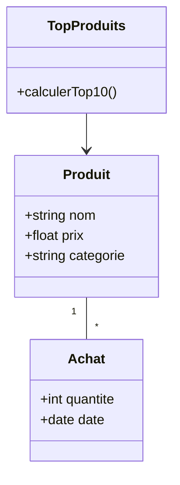

# Eco-Prix Yaoundé / TP INF232

Application de gestion intelligente des sessions d'achats.

## Diagramme de classe - Produits les plus achetés



## Installation

```bash
pip install flask
python app.py
```

## Auteur

Votre nom
